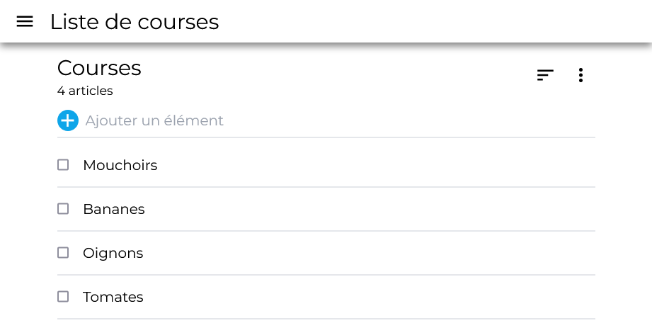
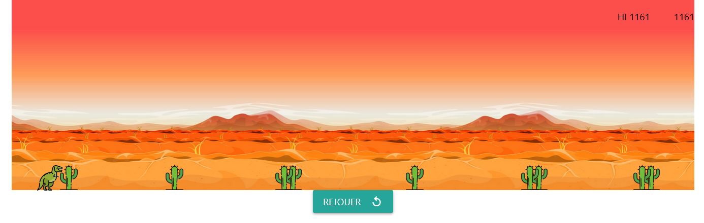
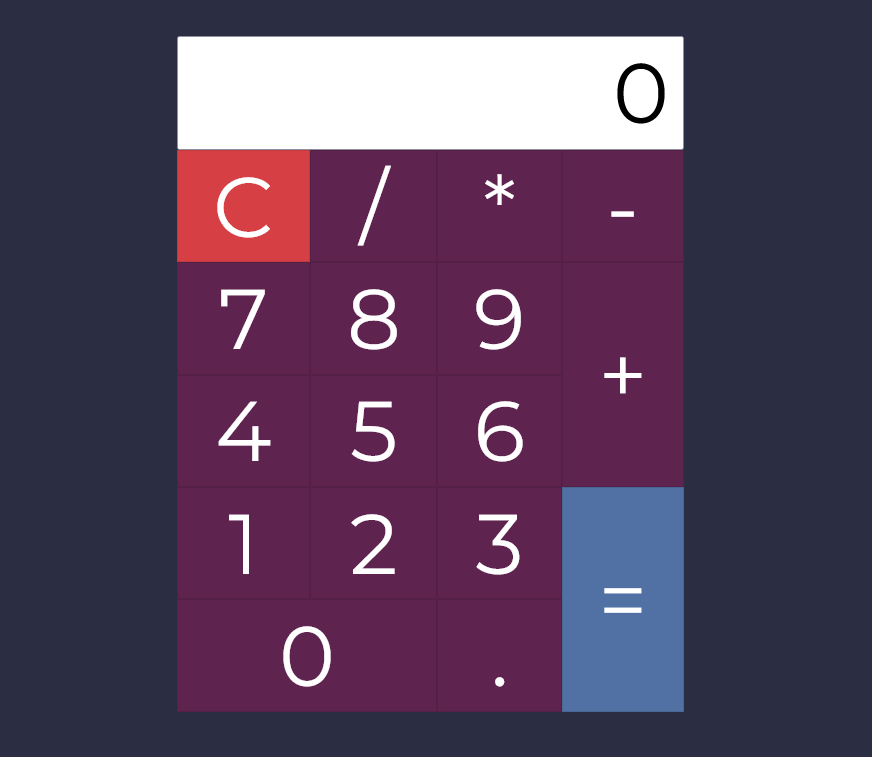
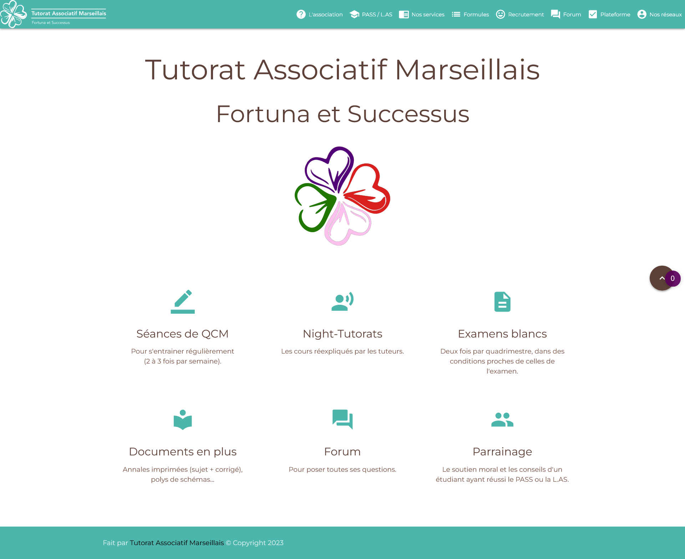

# Jérémy GAU

## À propos de moi

Je suis développeur fullstack et devops.

## Compétences

### Langages

### Frameworks

### DevOps

### Outils

## Projets

[Liste de courses](https://courses.jeremygau.fr)

[Sliders](https://sliders.jeremygau.fr)

[Dino color](https://www.jeremygau.fr/dino)

[Calculatrice](https://www.jeremygau.fr/Calculatrice)

[Tutorat Associatif Marseillais](http://tutorat-marseille.fr)
	

## Contact

[Mon site web](https://jeremygau.fr)

